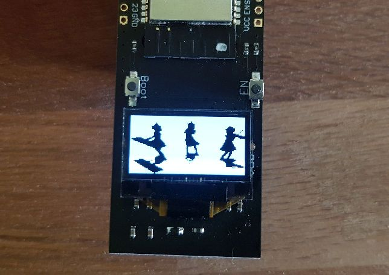

# ESP32 Video Display System

Play any black and white video on ESP32 with SSD1306 OLED display.

**Original Project**: Based on [ESP32_BadApple by Hackerspace-FFM](https://github.com/hackffm/ESP32_BadApple)



## Hardware Setup

### Required Components
- ESP32 development board
- SSD1306 OLED display (128x64)
- I2C connection: SDA to GPIO 21, SCL to GPIO 22

### Wiring
```
ESP32    OLED
3.3V  -> VCC
GND   -> GND
GPIO21 -> SDA
GPIO22 -> SCL
```

## Software Requirements
- Arduino IDE or PlatformIO
- ESP32 Arduino core
- Adafruit SSD1306 library

## Video Requirements
**IMPORTANT**: Videos must be black and white (monochrome) because the OLED is monochrome.

## Quick Setup

### 1. Prepare Your Video
1. Convert video to 128x64 PNG frames
2. Save as sequential files: `frame00001.png`, `frame00002.png`, etc.

### 2. Convert Video
Edit `Compress.py` to point to your frames:
```python
# Change path and frame count
for nr in range(1, YOUR_TOTAL_FRAMES + 1):
    fn = "path/to/your/frames/frame" + "{0:0>5}".format(nr) + ".png"
```

Run the conversion:
```bash
python Compress.py
```

This creates `data/video.hs` file.

### 3. Upload to ESP32
1. Upload the main sketch
2. Upload data via "Tools" → "ESP32 Sketch Data Upload"

## Controls
- **Normal mode**: 30 FPS
- **Button (GPIO0)**: Maximum speed

## Credits
Based on [ESP32_BadApple](https://github.com/hackffm/ESP32_BadApple) by Hackerspace-FFM

## License
MIT License